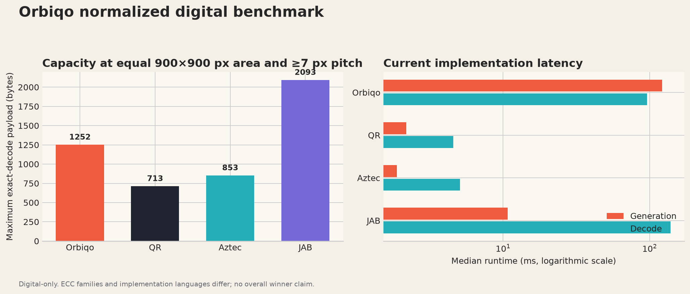

# Orbiqo — Optimized Normalized Digital Benchmark

**Owner:** Orbiqo Project  
**Scope:** Equal digital area; no printing claims  
**Artifact:** `benchmark/results/normalized_summary.json`

> After correcting the capacity search and optimizing the compatible Draft 0.3 implementation, Orbiqo reaches **1,252 exact-decoded payload bytes** in the equal-area proxy. This exceeds the tested QR Q and Aztec profiles, while JAB remains higher under its materially weaker level-3 ECC setting.

## Equal-area result

Every format occupies 900×900 pixels on a 1024×1024 canvas and must retain at least seven nominal pixels per smallest logical feature. The timing and degradation payload is the same deterministic 64-byte sequence. Capacity requires exact clean byte recovery.

| Format | Maximum payload | Boundary pitch | Profile |
| --- | ---: | ---: | --- |
| **Orbiqo** | **1,252 B** | 7.57 px | XL, COLOR4, Balanced RS(255,191) |
| QR | 713 B | 7.20 px | Auto geometry, ECC Q |
| Aztec | 853 B | 7.20 px | Auto geometry, writer-reported 22% |
| JAB | 2,093 B | 7.20 px | COLOR4, official CLI level 3 / 6% |

Under this proxy, Orbiqo holds **75.59% more payload than QR** and **46.77% more than Aztec**. It does not exceed JAB. These percentages are capacity observations, not an overall ranking: ECC families, finder overhead, cell geometry, and color classification differ. DENSO WAVE describes QR Q as approximately 25% restoration capability,[1] while the official JAB CLI reports 6% for the selected level.[2]

Orbiqo capacity discovery uses the normative SVG/Cairo raster. Timing and degradation use the optimized direct PNG renderer shipped in the lab. This prevents an evolving presentation rasterizer from being mistaken for the format ceiling while keeping product latency measurable.

## Implementation latency

| Format | Median generation | Median decode | Exact clean runs |
| --- | ---: | ---: | ---: |
| Orbiqo | **121.76 ms** | **96.23 ms** | 10/10 |
| QR | 2.19 ms | 4.57 ms | 10/10 |
| Aztec | 1.89 ms | 5.09 ms | 10/10 |
| JAB | 10.74 ms | 138.79 ms | 10/10 |

Compared with the preceding gate, Orbiqo capacity increased **119.26%**, median generation time fell **51.76%**, and median decode time fell **14.19%**. Across all four formats, exact synthetic degradation success rose from 86.72% to 89.84%, a gain of 3.13 percentage points. The Python implementation remains far slower than optimized ZXing-C++ QR/Aztec paths.[3] Orbiqo decode is now faster than the tested JAB command-process path, but that comparison includes JAB process startup.

## Robustness and visual identity

The common synthetic matrix improved from 111 to **115 exact decodes out of 128**. Orbiqo improved from 24/32 to **28/32**, passing clean, both blur profiles, noise, JPEG, downsample 0.35, and the combined profile. All four shared occlusion placements still fail. QR scores 31/32; Aztec and JAB each score 28/32.

The laboratory’s Pulse skin is evaluated separately as a renderer-only visual profile. It changes cell fill ratios without changing Draft 0.3 bytes, masks, palette, guard, or center-safe region. Pulse and Reference each passed four of five dedicated visual trials, but failed different stressors; Pulse is therefore a showroom identity rather than a robustness claim.

## Engineering conclusion

Orbiqo is no longer worse on every measured dimension. It now has a defensible equal-area capacity result against the tested QR and Aztec profiles, a visually distinctive radial presentation, and materially faster generation than its first gate. The remaining weaknesses are clear: latency versus ZXing, common occlusion, two extreme foreshortening regressions, and the gap to JAB capacity under JAB’s weaker selected ECC.

## References

[1]: https://www.qrcode.com/en/about/error_correction.html "DENSO WAVE — Error correction feature"
[2]: https://github.com/jabcode/jabcode "JAB Code official repository"
[3]: https://github.com/zxing-cpp/zxing-cpp "ZXing-C++ official repository"
